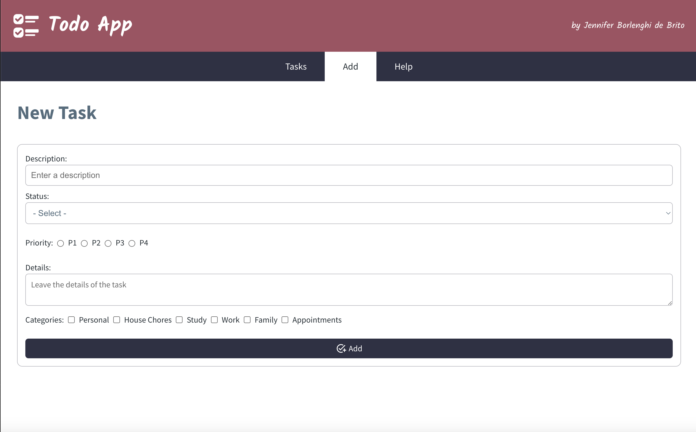

# To Do App

List what you need to do! Add categories, priority, details, and more!

## What did I use to build this application?

- React, React Icons, React Router Dom
- Redux
- SCCS, CSS
- Firebase Firestore
- Vercel: https://to-do-theta-ebon.vercel.app/

## Routes

1. “/” to display the tasks:
   

2. “/add” to add a new task:
   

3. “/help” to show help info - it has sub routes for help details:
   

4. “\*” not found page:
   

## How to use

1. Install the packages

```bash
npm install
```

2. Start the applications

```bash
npm start
```

## Project Structure

```
PROJECT_ROOT
├── public
├── readme-files
├── src
│   └── components          # React components
│   └── database            # Firebase config and functions
│   └── includes
│   └── pages
│   └── redux
│   └── styles              # SCSS styles
│   └── App.js
│   └── index.js
```
